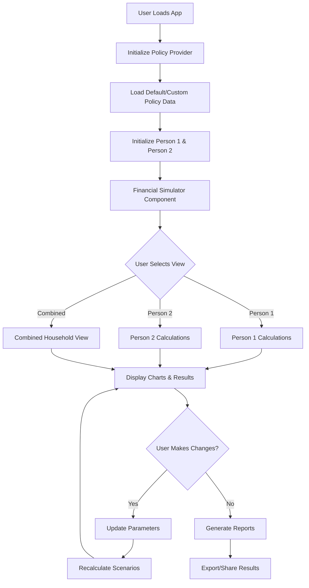
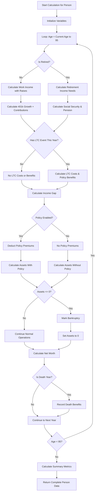
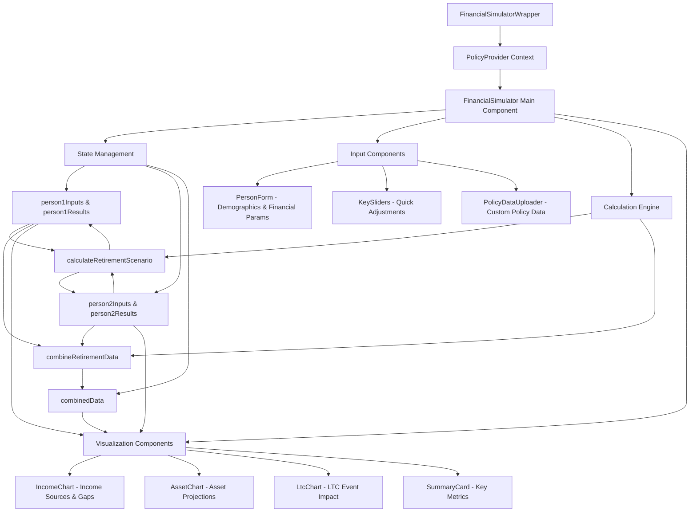

# Care Plan Studio Financial Simulator - Application Flowchart

## Overview
This is a comprehensive financial planning and Long-Term Care (LTC) insurance simulation webapp that projects financial scenarios for individuals or couples over their lifetime.

## High-Level Application Architecture



## Core Financial Calculation Flow



## Policy Data Integration Flow

```mermaid
graph LR
    A[Policy Data Source] --> B{Data Type?}
    B -->|Default| C[Built-in Sample Data]
    B -->|Custom Upload| D[User Uploaded Files]
    
    C --> E[Policy Provider Context]
    D --> F[Parse & Validate Upload]
    F --> E
    
    E --> G[Find Policy Data for Year]
    G --> H{Exact Year Match?}
    H -->|Yes| I[Use Exact Data]
    H -->|No| J[Interpolate Between Years]
    
    I --> K[Apply to Calculations]
    J --> K
    
    K --> L{Policy Enabled?}
    L -->|Yes| M[Calculate Premiums & Benefits]
    L -->|No| N[Skip Policy Calculations]
    
    M --> O[LTC Benefits During Events]
    N --> P[No Policy Benefits]
    O --> Q[Update Financial Projections]
    P --> Q
```



## Component Architecture & Data Flow



## Financial Calculation Details

### Income Calculation Logic
```mermaid
graph TD
    A[Start Year Calculation] --> B{Working or Retired?}
    B -->|Working| C[Annual Income × (1 + PayRaise%)^Years]
    B -->|Retired| D[Calculate Retirement Income Need]
    
    D --> E[Final Working Income × Income Replacement %]
    E --> F[Inflate for General Inflation Since Retirement]
    
    C --> G[Add to Assets: Income + 401k Growth + Contributions]
    F --> H[Calculate Income Sources]
    
    H --> I[Social Security + Pension + Policy Income]
    I --> J[Income Gap = Income Needed - Income Sources]
    
    G --> K[Subtract: Policy Premiums if Enabled]
    J --> L[Withdraw Income Gap from 401k]
    
    K --> M[Asset Balance for Next Year]
    L --> M
```

### LTC Event Handling
```mermaid
graph TD
    A[Check LTC Event Status] --> B{LTC Enabled & In Event Period?}
    B -->|No| C[No LTC Costs or Benefits]
    B -->|Yes| D[Calculate Inflated LTC Costs]
    
    D --> E[Monthly Need × 12 × LTC Inflation Factor]
    E --> F{Policy Enabled?}
    
    F -->|No| G[Full Out-of-Pocket LTC Costs]
    F -->|Yes| H[Calculate Policy Benefits]
    
    H --> I[Use COB Monthly Benefit from Policy Data]
    I --> J[Policy Benefits = Min(Monthly Benefit × 12, LTC Costs)]
    J --> K[Out-of-Pocket = LTC Costs - Policy Benefits]
    
    G --> L[Add to Income Needed]
    K --> L
    
    L --> M[Include in Total Income Gap Calculation]
```

## Key Features & Scenarios

### Scenario Comparison
- **With Policy**: Pays premiums, receives LTC benefits, has cash value growth
- **Without Policy**: No premiums, no benefits, more available for 401k growth
- **Bankruptcy Detection**: When assets hit zero during retirement
- **Legacy Planning**: Death benefits and remaining assets

### Data Visualization
- **Income Charts**: Work income, Social Security, pension, policy income, income gaps
- **Asset Charts**: 401k growth with/without policy, policy cash values
- **LTC Charts**: Costs, benefits, out-of-pocket expenses during events
- **Combined Views**: Household-level projections and summaries

### User Interactions
1. **Parameter Adjustments**: Age, income, retirement age, LTC settings
2. **Policy Toggles**: Enable/disable policies, switch between data sets
3. **Scenario Analysis**: Compare outcomes with different assumptions
4. **Report Generation**: Export findings for client presentations

## Technical Implementation Notes

### State Management
- **Input State**: User-modifiable parameters
- **Results State**: Calculated projections (read-only)
- **Immediate Recalculation**: Changes trigger instant updates
- **Policy Context**: Manages default vs. custom policy data

### Performance Optimizations
- **Memoized Calculations**: Avoid unnecessary recalculations
- **Debounced Updates**: Prevent excessive calculations during user input
- **Incremental Updates**: Only recalculate affected scenarios

### Error Handling
- **Bankruptcy Scenarios**: Graceful handling when assets are depleted
- **Data Validation**: Ensure realistic parameter ranges
- **Policy Data Fallbacks**: Handle missing or invalid policy years

This flowchart represents the complete logic flow of the financial planning simulator, showing how user inputs flow through calculations to generate comprehensive retirement and LTC planning scenarios.